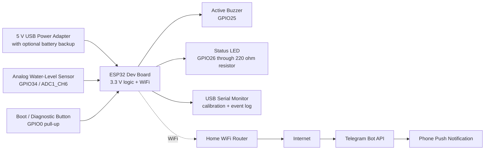

# Smart Flood Detection System Block Diagram

## Signal Flow

1. The water sensor outputs an analog voltage proportional to water contact or depth.
2. The ESP32 samples the sensor on ADC1 channel 6, debounces the reading, and classifies the state as normal or water detected.
3. A detected-water event is sent to the local alarm queue before the remote alert queue.
4. The alarm task turns on the buzzer and status LED without depending on WiFi.
5. If WiFi is connected and Telegram credentials are configured, the alert task sends a remote notification.
6. State changes are stored in a RAM ring buffer and can be dumped over USB serial.

