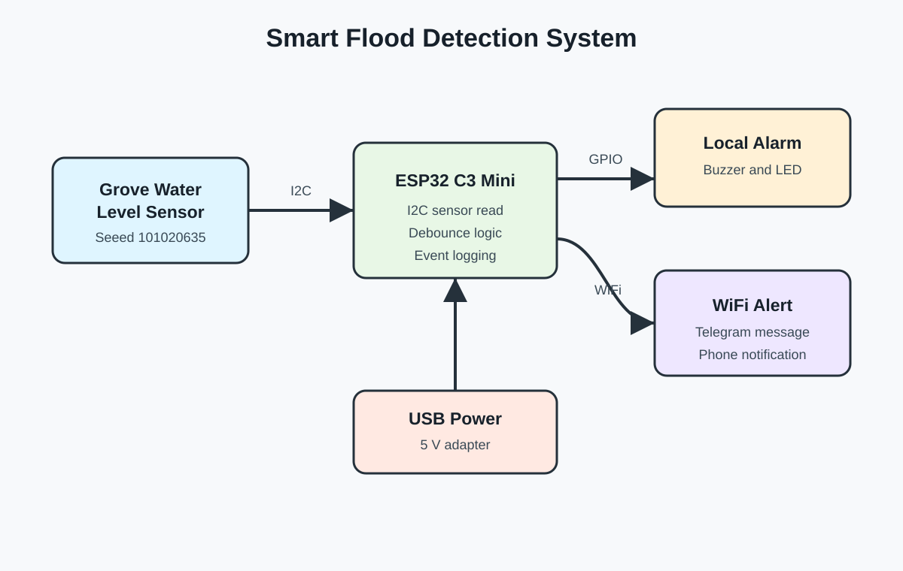

# Block Diagram

The Grove water sensor connects to the ESP32 C3 Mini with I2C. The ESP32 C3 Mini turns on the local buzzer and LED when water is detected. If WiFi is working, it also sends a Telegram alert.
